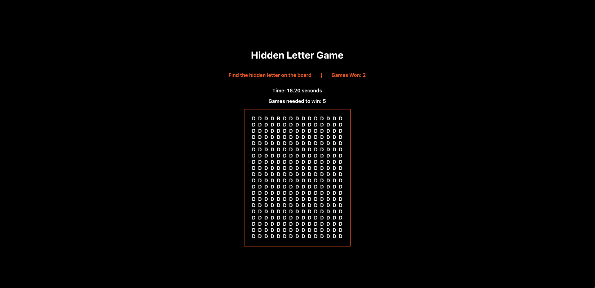

# Hiidden Game App

### This is a little react project to find a hidden letter on a game board

## Screenshots

## External Libraries Used

<a href="https://www.npmjs.com/package/react-confetti-explosion?activeTab=readme">Confetti</a>
<a href="https://github.com/joshwcomeau/use-sound">Use Sound</a>

# About this project

This project was bootstrapped with [Create React App](https://github.com/facebook/create-react-app).

## Available Scripts

To run this project locally, you can run the following commands:

### `npm install`

### `npm start`
